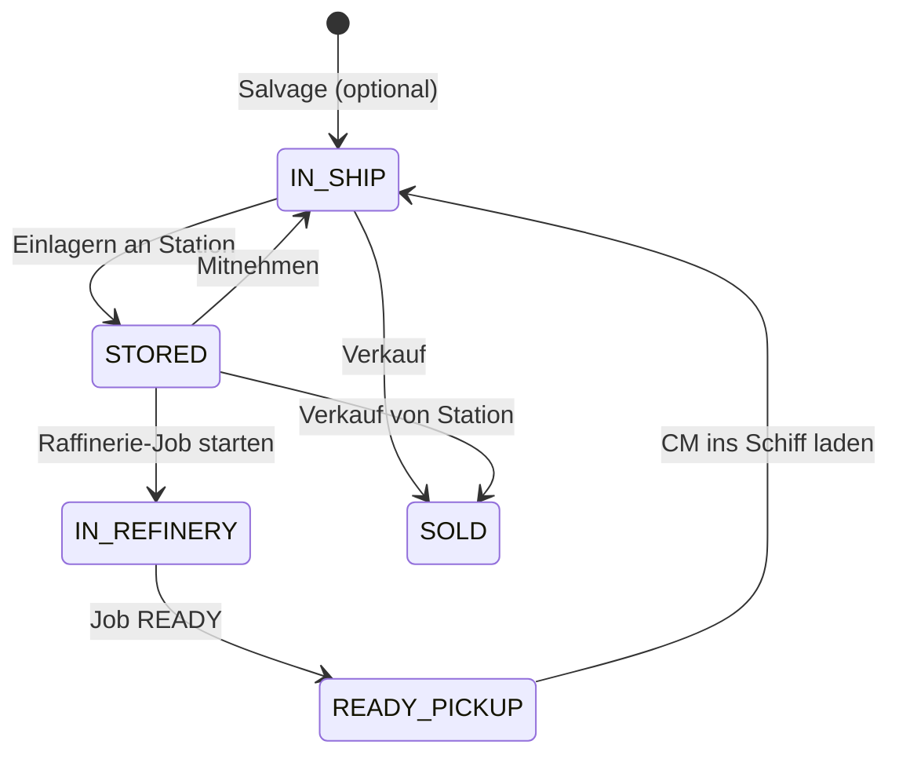

# Spezifikation — Standorte & Lager

Stand: 2026-06-28 · **Implementiert (v0.16.0 Beta)**

Basis: [Session-Notizen Workflows](SESSION_NOTES_2026-06-28_WORKFLOWS_UND_STANDORTE.md)

Datenquellen:
- [Space stations (Wiki)](https://starcitizen.tools/Category:Space_stations)
- [Refinery Deck (Wiki)](https://starcitizen.tools/Refinery_Deck)

Vorbereitete Config (mit UI-Anbindung ab 0.16.0):
- `config/locations/stations.json`
- `config/locations/landing_zones.json`
- `config/locations/catalog.py` — Dropdown-Gruppen (Comm Arrays ausgeblendet)
- `config/locations/cscu.py` — SCU ↔ cSCU
- `ui/location_combo.py` — gruppierte Standort-Combobox
- Raffinerie + Verkauf nutzen Standort-Dropdowns

---

## 1. Ziel

Der Tracker soll beantworten: **Wo liegt wie viel von welchem Material — und seit wann?**

Heute: `storage_items` ist **global** (kein Ort). Raffinerie-Jobs haben Freitext-Station. Verkäufe haben bereits `sales.location`.

---

## 2. Material-Status (Zustandsmodell)

| Status | Bedeutung | Im Tracker |
|--------|-----------|------------|
| `IN_SHIP` | Noch nicht abgegeben | Optional erfasst (Schiff + Menge) |
| `STORED` | An Station/Stadt/Lager | **Kernfall** — Standort-Seite |
| `IN_REFINERY` | Im Raffinerie-Job | Bereits über `refinery_jobs` |
| `READY_PICKUP` | Job fertig, CM noch nicht geladen | Refinery READY + Lagerort Station |
| `SOLD` | Verkauft | `sales` + Historie |
| `RESERVED` | Bewusst gelagert (Tag) | Keine 10-Tage-Warnung |

Übergänge (vereinfacht):



---

## 3. Datenmodell (Vorschlag)

### 3.1 Neue Tabelle `material_stockpiles`

Ort-bezogener Bestand — **neben** bestehendem `storage_items` (schrittweise Angleichung).

```sql
CREATE TABLE material_stockpiles (
    id INTEGER PRIMARY KEY AUTOINCREMENT,

    material_type_id INTEGER NOT NULL,

    quantity_scu REAL NOT NULL CHECK (quantity_scu >= 0),

    -- Ort (optional — NULL = legacy/unbekannt)
    location_kind TEXT NOT NULL DEFAULT 'STATION',
    -- STATION | CITY | SHIP | REFINERY | BASE (Zukunft) | UNKNOWN

    location_key TEXT,
    -- z.B. 'HUR-L1', 'ORISON', ship_id als Text

    location_label TEXT NOT NULL,
    -- Anzeigename (auch bei Freitext)

    status TEXT NOT NULL DEFAULT 'STORED',
    -- STORED | IN_SHIP | IN_REFINERY | READY_PICKUP | RESERVED

    session_id INTEGER,
    refinery_job_id INTEGER,
    storage_item_id INTEGER,

    reserve_tag TEXT,
    -- z.B. 'Reserve', 'Verkauf spaeter' — unterdrückt Idle-Warnung

    notes TEXT,

    last_activity_at TEXT NOT NULL,
    created_at TEXT NOT NULL DEFAULT (datetime('now', 'localtime')),
    updated_at TEXT,

    is_deleted INTEGER NOT NULL DEFAULT 0,
    deleted_at TEXT,

    FOREIGN KEY (material_type_id) REFERENCES material_types(id),
    FOREIGN KEY (session_id) REFERENCES sessions(id),
    FOREIGN KEY (refinery_job_id) REFERENCES refinery_jobs(id),
    FOREIGN KEY (storage_item_id) REFERENCES storage_items(id)
);
```

Indizes: `(location_key, material_type_id)`, `(status)`, `(last_activity_at)`.

### 3.2 Historie `material_stockpile_events`

Alles nachvollziehbar; Spieler darf Einträge löschen (soft delete).

```sql
CREATE TABLE material_stockpile_events (
    id INTEGER PRIMARY KEY AUTOINCREMENT,
    stockpile_id INTEGER,
    event_type TEXT NOT NULL,
    -- DEPOSIT | MOVE | WITHDRAW | REFINERY_START | REFINERY_COMPLETE
    -- | SALE | TAG_SET | NOTE
    quantity_delta REAL,
    from_label TEXT,
    to_label TEXT,
    payload_json TEXT,
    notes TEXT,
    created_at TEXT NOT NULL DEFAULT (datetime('now', 'localtime')),
    is_deleted INTEGER NOT NULL DEFAULT 0,
    deleted_at TEXT,
    FOREIGN KEY (stockpile_id) REFERENCES material_stockpiles(id)
);
```

### 3.3 Erweiterungen bestehender Tabellen

| Tabelle | Änderung |
|---------|----------|
| `refinery_jobs` | `station` → /skript → `station_id` (FK optional) + `station_label`; Input/Output weiter in SCU, UI zeigt cSCU |
| `storage_items` | Später: `stockpile_id` oder Ort-Spalten — **Phase 2** |
| `sales` | `location` → Dropdown aus `sale_location_dropdown_groups()` |

### 3.4 Migration bestehender Daten

1. Bestehende `storage_items` ohne Ort → `location_kind = 'UNKNOWN'`, `location_label = 'Unbekannt (Legacy)'`.
2. Aktive Raffinerie-Jobs → synthetischer Eintrag `IN_REFINERY` an Job-Station.
3. Keine automatische Aufteilung — Nutzer kann nachträglich Orte pflegen.

---

## 4. cSCU-Umrechnung (Raffinerie)

Ingame-Terminal: **centi-SCU (cSCU)**. Tracker: **SCU**.

| Regel | Wert |
|-------|------|
| Faktor | **100 cSCU = 1 SCU** |
| Beispiel Input | 20 SCU → 2.000 cSCU |
| Beispiel Output | 600 cSCU → 6 SCU |

UI an Raffinerie-Formular (`refinery_page.py`):
- SCU-Felder bleiben primär (Buchführung).
- Live-Hinweis darunter: `format_cscu_hint(scu)` aus `config/locations/cscu.py`.
- Optional: Toggle „Terminal-Werte (cSCU)“ — Eingabe in cSCU, intern sofort nach SCU.

---

## 5. Stationen-Dropdown

Quelle: `config/locations/stations.json`, geladen via `catalog.station_dropdown_groups()`.

Struktur pro System (Reihenfolge **Stanton → Pyro → Nyx**):

1. **Mit Raffinerie** — Rest Stops L-Serie, Gateways, Everus Harbor, Checkmate, …
2. **Ohne Raffinerie** — Comm Arrays, Grim HEX, Port Olisar, OLPs, …

Verkauf zusätzlich: Landeplätze aus `landing_zones.json` (Orison, Area18, Lorville, New Babbage, Levski, …).

**Freitext** bleibt als letzte Option („Andere Station…“) für Edge Cases.

---

## 6. UI — Seite „Lager / Standorte“

Neuer Navigationspunkt (SOLO): zwischen Dashboard und Verkauf oder unter Material.

### 6.1 Layout (Wireframe)

```
┌─────────────────────────────────────────────────────────────┐
│  Lager / Standorte                              [+ Eintrag] │
├─────────────────────────────────────────────────────────────┤
│  Filter: [System ▼] [Material ▼] [Nur Warnungen ☐]         │
│  Sort:   (•) Nach Ort   ( ) Nach Material   ( ) Alter      │
├─────────────────────────────────────────────────────────────┤
│  ⚠ 3 Bestände > 10 Tage ohne Bewegung (dezent, einklappbar)│
├─────────────────────────────────────────────────────────────┤
│  HUR-L1 Green Glade · Stanton                               │
│    RMC        12,5 SCU    vor 14 Tagen    [Tag] [Verschieben]│
│  CRU-L1 · Stanton · Raffinerie                              │
│    CM Rubble   8,0 SCU    vor 2 Tagen     [Tag] [→ Raffinerie]│
│  Orison · Landeplatz                                        │
│    CM          6,0 SCU    Reserve 🏷       [Tag bearbeiten]   │
├─────────────────────────────────────────────────────────────┤
│  Summe RMC gesamt: 45,5 SCU  |  CM: 22,0 SCU               │
└─────────────────────────────────────────────────────────────┘
```

### 6.2 Dialog „Material einlagern“ (Session-Flow)

Nach Material-Batch an Station (optional, nicht Pflicht):

- Station (Dropdown)
- Material + Menge SCU
- Notiz
- Checkbox „Als Reserve markieren“

### 6.3 Idle-Warnung (10 Tage)

- `last_activity_at` älter als 10 Tage **und** kein `reserve_tag` **und** status `STORED`.
- Banner oben auf Lager-Seite + kleines Badge in Sidebar (nicht modal, kein Sound).
- Wiederholung alle 10 Tage (nicht täglich nerven).
- Aktionen: „Erinnert“, „Reserve setzen“, „Verschoben/entnommen“.

### 6.4 Historie-Tab

Chronologische Liste aus `material_stockpile_events`; pro Zeile **Löschen** (soft delete, Bestätigung).

---

## 7. Anbindung bestehender Flows

| Flow | Änderung |
|------|----------|
| Session → Material Batch | Optional: „Gleich an Station einlagern?“ |
| Raffinerie Job anlegen | Station-Dropdown statt QLineEdit; cSCU-Hinweis; bei Start optional RMC-Lager an gleicher Station |
| Raffinerie READY | CM-Abholung → neuer Stockpile `IN_SHIP` oder `STORED` |
| Verkauf | Ort-Dropdown (Station + Stadt); Abzug vom gewählten Stockpile |
| Dashboard KPI | „Offene Lagerorte“, „Ältester Bestand“ |

---

## 8. Implementierungsphasen

| Phase | Inhalt | Risiko |
|-------|--------|--------|
| **A** | ✅ Dropdowns (Raffinerie, Verkauf) + cSCU-Hinweis | Erledigt |
| **B** | ✅ DB `material_stockpiles` + Repository + Lager-Seite (manuell) | Erledigt |
| **C** | Lager-Seite + 10-Tage-Hinweis + Reserve-Tags | Mittel |
| **D** | Verkauf/Raffinerie/Session automatisch verknüpfen | Hoch |
| **E** | Legacy-Migration + CREW Multi-User | Später |

**Empfohlener Start:** Phase A (sofort nutzbar, kein Schema-Bruch) → B → C.

---

## 9. CREW/ORGA (später, nur Notizen)

- Mehrere aktive Sessions → Stockpile `session_id` + Crew-Sicht.
- Verkauf: Auszahlung an `created_by` / Verkäufer.
- Raffinerie `paid_by` bereits vorhanden — beibehalten.

---

## 10. Offene Punkte

1. **Material im Schiff:** Ja — pro Schiff führen (Phase B/C).
2. Comm Arrays im Dropdown **ausgeblendet** (`category: comm_array`).
3. Automatische Stockpile-Erstellung bei Raffinerie-Job — Phase D.

---

*Implementierung startet nach expliziter Freigabe — empfohlen mit Phase A.*
